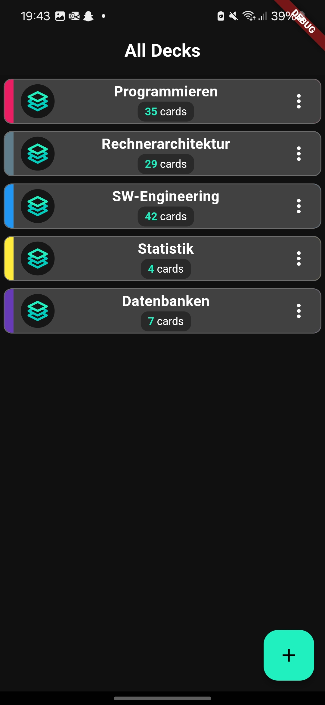
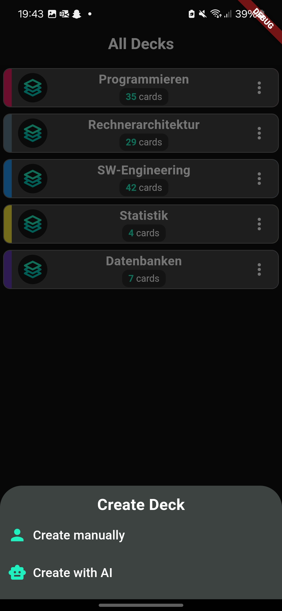
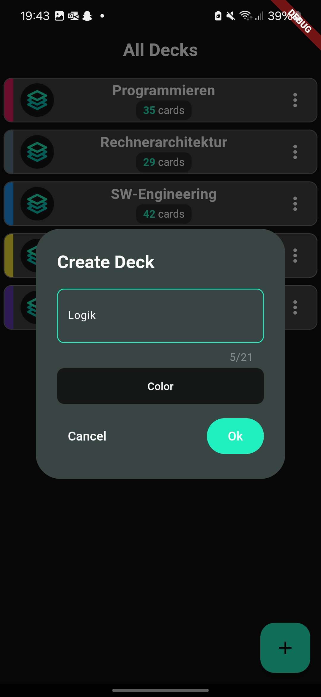
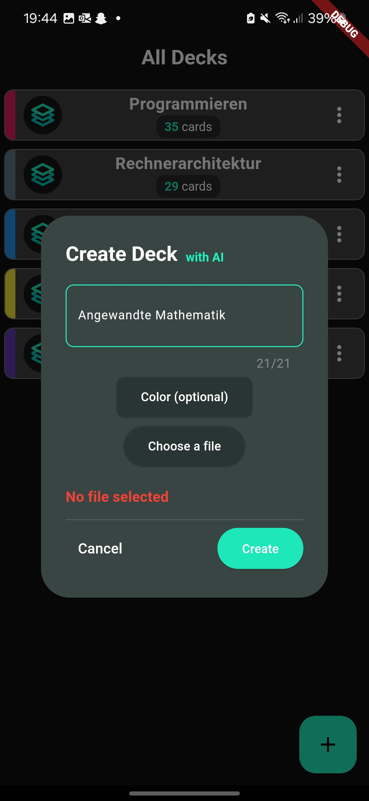
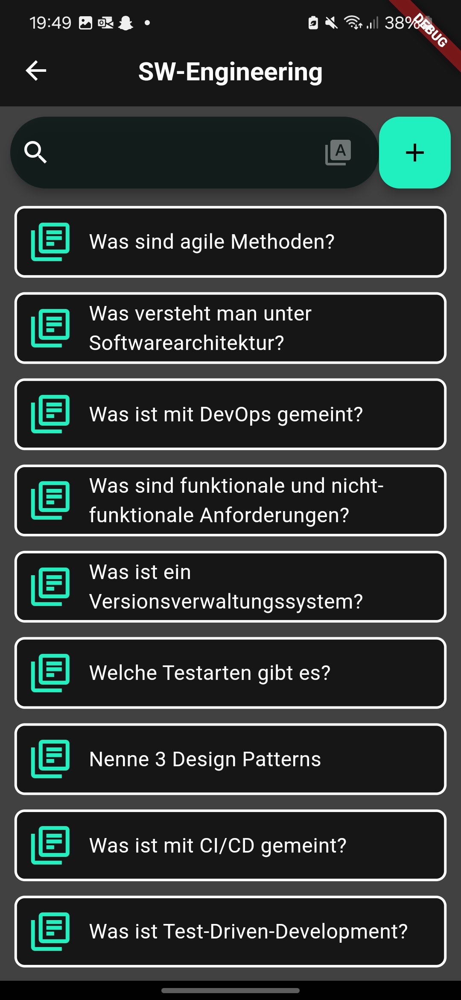

# AIDex


[](https://flutter.dev/)
[](https://dart.dev/)
[](https://bloclibrary.dev/#/)
[](https://openai.com/)

## Table of Contents

1. [Introduction](#introduction)
2. [Features](#features)
3. [Screenshots](#screenshots)
4. [Getting Started](#getting-started)
5. [Project Structure](#project-structure)
6. [Dependencies](#dependencies)
8. [License](#license)
9. [Contact](#contact)

## Introduction

AIDex is a mobile application designed to facilitate the generation of index cards. It leverages the power of OpenAI's
ChatGPT to generate content for the index cards, making it an ideal tool for students, researchers, and anyone in need
of a quick and efficient way to create and manage index cards.

## Features

- User-friendly interface for creating, managing, and sorting index cards.
- Integration with ChatGPT for efficient content generation.
- BLoC architecture pattern for clean, manageable codebase.

## Screenshots

Include screenshots to showcase the UI and important features.
<table>
  <tr>
    <td></td>
    <td></td>
    <td></td>
  </tr>
  <tr>
    <td></td>
    <td></td>
    <td></td>
  </tr>
</table>

## Getting Started

### Prerequisites

- Flutter SDK
- Dart SDK
- Android Studio or Xcode for mobile app development

### Installation

1. Clone the repository.
   ```bash
   git clone https://github.com/ulfi03/aidex.git

2. Change into the project directory.
   ```bash
   cd aidex
   ```
3. Install dependencies.
   ```bash
   flutter pub get

### Running the App

1. Ensure a device or emulator is available.
2. Use the following command to run the app.
   ```bash
   flutter run
   ```

## Project Structure

The project structure is as follows:

```
aidex/
│── android/ # Android specific files
│── assets/
│ └── icon/ # App icons
│── doc/ # Documentation files
│ ├── mockups/ # Mockups for the app
│ ├── product-vision/ # Product vision documents
│ ├── retrospectives/ # Retrospective documents
│ └── screenshots/ # Screenshots of the app
│── integration_test/ # Integration tests
│── lib/
│ ├── bloc/ # BLoC related files
│ ├── data/ # Data related files
│ ├── ui/ # UI related files
│ └── main.dart # Entry point for the app
│── test/ # Unit and widget tests
│── pubspec.yaml # Flutter project configuration
└── README.md # This README file
```

## Dependencies

Flutter - Framework for building the app.
BLoC - State management.
OpenAI - AI services.

- [Flutter](https://flutter.dev/) - Framework for building the app.
- [BLoC](https://bloclibrary.dev/#/) - State management.
- [OpenAI](https://openai.com/) - AI services.

## License

This project is currently not licensed.

## Contact

- Project Owner: [Marius Ulfers](https://github.com/ulfi03)

---

Thank you for using our project! If you have any suggestions or feedback, please feel free to reach out.