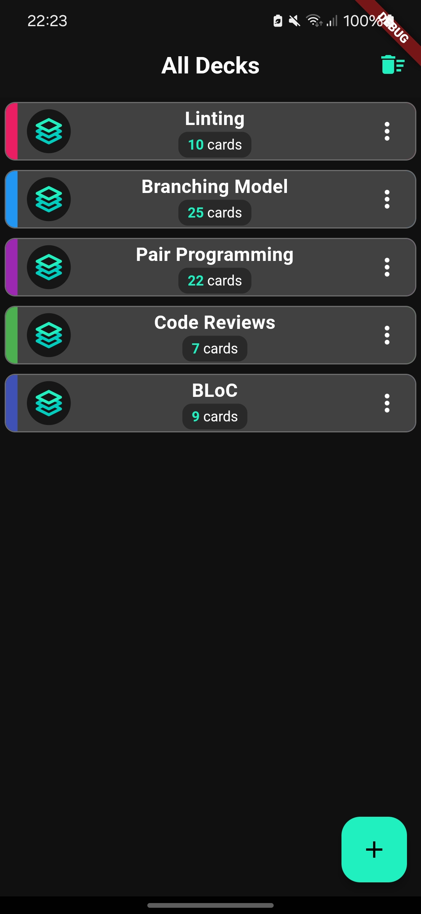

# AIDex


[](https://flutter.dev/)
[](https://dart.dev/)
[](https://bloclibrary.dev/#/)
[](https://openai.com/)

## Table of Contents

1. [Introduction](#introduction)
2. [Features](#features)
3. [Screenshots](#screenshots)
4. [Getting Started](#getting-started)
5. [Project Structure](#project-structure)
6. [Bloc Architecture](#bloc-architecture)
7. [Example](#example---indexcardoverview)  
   7.1 [IndexCardItemWidget](#indexcarditemwidget)  
   7.2 [IndexCardOverviewBloc](#indexcardoverviewbloc)  
   7.3 [BlocBuilder (IndexCardOverview)](#blocbuilder-indexcardoverview)
8. [Code Example](#code-example)
9. [AIDex Server](#AIDex-server)
10. [Dependencies](#dependencies)
11. [License](#license)
12. [Contact](#contact)

## Introduction

AIDex is a mobile application designed to facilitate the generation of index cards. It leverages the power of OpenAI's
ChatGPT to generate content for the index cards, making it an ideal tool for students, researchers, and anyone in need
of a quick and efficient way to create and manage index cards.


## Features

- User-friendly interface for creating, managing, and sorting index cards.
- Integration with ChatGPT for efficient content generation.
- BLoC architecture pattern for clean, manageable codebase.

## Screenshots

Include screenshots to showcase the UI and important features.
<table>
   <tr>
      <td></td>
      <td></td>
      <td></td>
   </tr>
   <tr>
      <td></td>
      <td></td>
      <td></td>
   </tr>
   <tr>
      <td></td>
      <td></td>
      <td></td>
   </tr>
</table>

## Getting Started

### Prerequisites

- Flutter SDK
- Dart SDK
- Android Studio or Xcode for mobile app development

### Installation

1. Clone the repository.
   ```bash
   git clone https://github.com/ulfi03/aidex.git

2. Change into the project directory.
   ```bash
   cd aidex
   ```
3. Install dependencies.
   ```bash
   flutter pub get

### Running the App

1. Ensure a device or emulator is available.
2. Use the following command to run the app.
   ```bash
   flutter run
   ```

## Project Structure

The project structure is as follows:

```
aidex/
│── android/ # Android specific files
│── assets/
│ └── icon/ # App icons
│── doc/ # Documentation files
│ ├── mockups/ # Mockups for the app
│ ├── product-vision/ # Product vision documents
│ ├── retrospectives/ # Retrospective documents
│ └── screenshots/ # Screenshots of the app
│── integration_test/ # Integration tests
│── lib/
│ ├── bloc/ # BLoC related files
│ ├── data/ # Data related files
│ ├── ui/ # UI related files
│ └── main.dart # Entry point for the app
│── test/ # Unit and widget tests
│── pubspec.yaml # Flutter project configuration
└── README.md # This README file
```

## Dependencies

- [Flutter](https://flutter.dev/) - Framework for building the app.
- [BLoC](https://bloclibrary.dev/#/) - State management.
- [OpenAI](https://openai.com/) - AI services.

## BLoC Architecture

BLoC stands for "Business Logic Component" and is a popular architecture pattern in Flutter. It helps you separate
business logic from the user interface, allowing you to maintain a clean structure in your apps. BLoC relies on the
concept of streams, where data flows in one direction. You have two primary components: the BLoC itself and the UI (user
interface). The BLoC is where you handle all the business logic, while the UI listens for updates from the BLoC.

An important addition to the pattern is the data component, which encompasses the source of truth for your application's
data. This component might include services, repositories, or data storage, and is responsible for fetching, storing,
and updating data from various sources like APIs, local databases, or files. In the BLoC architecture, the BLoC acts as
a bridge between the UI and the data component. It receives events from the UI, retrieves or manipulates data via the
data component, and then streams the resulting states back to the UI.


### Benfits

| Benefit                  | Description                                                                                                             |
|--------------------------|-------------------------------------------------------------------------------------------------------------------------|
| Separation of Concerns   | BLoC architecture separates business logic from UI, which makes the codebase cleaner and easier to maintain.            |
| Testability              | Since the business logic is separated from the UI, it's easier to write unit tests for the business logic.              |
| Reusability              | BLoC components can be reused across different parts of the app or even across different apps.                          |
| Predictability           | BLoC architecture follows a predictable data flow, which makes it easier to understand how the state changes over time. |
| Consistency              | BLoC enforces a consistent way of managing state and handling business logic across the entire app.                     |
| Scalability              | BLoC architecture is highly scalable. It works equally well for small and large projects.                               |
| Integration with Flutter | BLoC architecture works seamlessly with Flutter's reactive model.                                                       |

## Example - IndexCardOverview

Index cards are organized within [`Decks`](lib/data/model/deck.dart) in the AIDex app.
The [`IndexCardOverview`](lib/ui/deck-view/index_cards_overview_widget.dart) widget displays all the index cards within
a [`Deck`](lib/data/model/deck.dart).


Users are able to select and delete those index cards. The following example
demonstrates how the BLoC architecture
is used to manage the selection and deletion of index cards.

The following table shows the different states of
the [`IndexCardOverview`](lib/ui/deck-view/index_cards_overview_widget.dart) and how they are displayed in the UI.

<a name="indexCardOverviewStates"></a>
<table>
   <tr>
    <th><p>IndexCardsLoading</p></th>
    <th><p>IndexCardSelectionMode</p></th>
    <th><p>IndexCardsLoaded</p></th>
    <th><p>IndexCardsError</p></th>
  </tr>
  <tr>
    <td></td>
    <td></td>
    <td></td>
    <td></td>
  </tr>
</table>

In the BLoC architecture states and events are objects being exchanged between the BLoC and the UI. The BLoC emits
states causing the UI to rebuild. During the rebuild the UI can access the data of the current state and change the
display accordingly. The BlocBuilder is a widget that performs these rebuilds in the Flutter widget-tree. To change the
state the UI itself can trigger events which are captured by the BLoC. The BLoC is responsible for handling these events
and emitting subsequent states.

This table shows all the states, events, and their attributes used
in [`IndexCardOverviewBloc`](lib/bloc/index_cards_overview_bloc.dart):

<div style="display: flex; justify-content: space-between;">
<table style="width: 45%; float: left;">
  <thead>
    <tr>
      <th>Events</th>
      <th>Attributes</th>
      <th>Action</th>
    </tr>
  </thead>
  <tbody>
    <tr>
      <td>FetchIndexCards</td>
      <td></td>
      <td>Fetch index cards from the database.</td>
    </tr>
    <tr>
      <td>UpdateSelectedIndexCards</td>
      <td>List&lt;int&gt; indexCardIds</td>
      <td>Update the list of selected index cards.</td>
    </tr>
    <tr>
      <td>ExitIndexCardSelectionMode</td>
      <td></td>
      <td>Exit the index card selection mode.</td>
    </tr>
    <tr>
      <td>RemoveIndexCardsById</td>
      <td>List&lt;int&gt; selectedIndexCardsIds</td>
      <td>Remove selected index cards by their IDs.</td>
    </tr>
    <tr>
      <td>AddIndexCard</td>
      <td>IndexCard indexCard</td>
      <td>Add a new index card.</td>
    </tr>
    <tr>
      <td>SearchIndexCards</td>
      <td>String query</td>
      <td>Search for index cards based on a query.</td>
    </tr>
    <tr>
      <td>SortIndexCards</td>
      <td>bool sortAsc</td>
      <td>Sort index cards in ascending or descending order.</td>
    </tr>
  </tbody>
</table>

<div style="width: 10%; float: left;"></div>

<table style="width: 45%; float: right;">
  <thead>
    <tr>
      <th>States</th>
      <th>Attributes</th>
      <th>Description</th>
    </tr>
  </thead>
  <tbody>
    <tr>
      <td>IndexCardInitial</td>
      <td></td>
      <td>The initial state of the index cards overview (contains no index cards).</td>
    </tr>
    <tr>
      <td>IndexCardsLoading</td>
      <td>String query</td>
      <td>Represents the loading state when fetching index cards.</td>
    </tr>
    <tr>
      <td>IndexCardsLoaded</td>
      <td>List&lt;IndexCard&gt; indexCards, <br/>String query</td>
      <td>Represents the state when index cards are successfully loaded.</td>
    </tr>
    <tr>
      <td>IndexCardSelectionMode</td>
      <td>List&lt;int&gt; indexCardIds, List&lt;IndexCard&gt; indexCards</td>
      <td>Represents the state for selecting index cards.</td>
    </tr>
    <tr>
      <td></td>
      <td>function: <br/>bool isThisCardSelected(final int indexCardId)</td>
      <td></td>
    </tr>
    <tr>
      <td>IndexCardsError</td>
      <td>String message</td>
      <td>Represents the state when an error occurs.</td>
    </tr>
  </tbody>
</table>
</div>

The [`IndexCardItemWidget`](lib/ui/deck-view/index_card_item_widget.dart)
class, which is a widget used to display an
index card item in [index_cards_overview_widget.dart](lib/ui/deck-view/index_cards_overview_widget.dart). These
widgets use the BLoC  (Business Logic
Component) Architecture [`IndexCardOverviewBloc`](lib/bloc/index_cards_overview_bloc.dart) to select `indexCards`.

For selecting and deleting index cards the cycle proceeds as follows:

The [`updateSelection(context)`](lib/ui/deck-view/index_card_item_widget.dart) method triggers the
Event [`IndexCardSelectionMode`](lib/bloc/index_cards_overview_bloc.dart).

[`updateSelection(context)`](lib/ui/deck-view/index_card_item_widget.dart) (
in [`IndexCardItemWidget`](lib/ui/deck-view/index_cards_overview_widget.dart)) itself is triggered given two scenarios:

1. Only if the BLoCs state is not in [`IndexCardSelectionMode`](lib/bloc/index_cards_overview_bloc.dart):  
   Long-pressing the [`IndexCardItemWidget`](lib/ui/deck-view/index_card_item_widget.dart) will trigger
   the [`updateSelection(context)`](lib/ui/deck-view/index_card_item_widget.dart) method handled in
   the `onLongPress` parameter
   of `GestureDetector`. This will select the
   long-pressed [`IndexCardItemWidget`](lib/ui/deck-view/index_card_item_widget.dart) in
   the [`IndexCardOverview`](lib/ui/deck-view/index_cards_overview_widget.dart) as
   follows.


2. Only if the BLoCs state is already in [`IndexCardSelectionMode`](lib/bloc/index_cards_overview_bloc.dart)):  
   Tapping on [`IndexCardItemWidget`](lib/ui/deck-view/index_card_item_widget.dart) will trigger
   the [`updateSelection(context)`](lib/ui/deck-view/index_card_item_widget.dart) method handled in the `onTap`
   parameter
   of the `GestureDetector` widget.
   This selects the tapped [`IndexCardItemWidget`](lib/ui/deck-view/index_card_item_widget.dart) in
   the [`IndexCardOverview`](lib/ui/deck-view/index_cards_overview_widget.dart) or deselects if it was already selected.

The [`updateSelection(context)`](lib/ui/deck-view/index_card_item_widget.dart) method is a crucial part of
the [`IndexCardItemWidgets`](lib/ui/deck-view/index_card_item_widget.dart) interaction with the BLoC
architecture. This method is responsible for managing the selection of the index card. It adds an index card to the
selected index cards
list if it isn't selected, or removes the index card from the selected index cards list if it was selected. After one of
these operations on the selected index cards list, it updates the selected index cards list in the bloc.

[`updateSelection(context)`](/lib/ui/deck-view/index_card_item_widget.dart) is called with the current `BuildContext`
as an argument. This
context is used to access the [`IndexCardOverviewBloc`](lib/bloc/index_cards_overview_bloc.dart) and add
the [`UpdateSelectedIndexCards`](lib/bloc/index_cards_overview_bloc.dart) event to it with the
updated list of selected index cards.

This interaction between the [`IndexCardItemWidget`](/lib/ui/deck-view/index_card_item_widget.dart) and
the [`IndexCardOverviewBloc`](lib/bloc/index_cards_overview_bloc.dart) is a typical example of the BLoC
architecture, where the UI components (widgets) dispatch events to the BLoC, and the BLoC updates the state based on
these events. The widgets then rebuild based on the new state.

#### IndexCardItemWidget

```dart
void updateSelection(final BuildContext context) {
  final List<int> selectedIndexCardIds =
  (_state is IndexCardSelectionMode) ? _state.indexCardIds : [];
  if (!selectedIndexCardIds.contains(indexCard.indexCardId)) {
    selectedIndexCardIds.add(indexCard.indexCardId!);
  } else {
    selectedIndexCardIds.remove(indexCard.indexCardId);
  }
  context.read<IndexCardOverviewBloc>().add(
    UpdateSelectedIndexCards(indexCardIds: selectedIndexCardIds),
  );
}
```

The following line checks if the current state of the BLoC
is [`IndexCardSelectionMode`](lib/bloc/index_cards_overview_bloc.dart). If it is, it assigns the list of
currently selected
index card IDs (which is the attribute ```List<int> indexCardIds``` which it gets from the
state [`IndexCardSelectionMode`](lib/bloc/index_cards_overview_bloc.dart)) to `selectedIndexCardIds`. If it's not
in [`IndexCardSelectionMode`](lib/bloc/index_cards_overview_bloc.dart),
then [`IndexCardSelectionMode`](lib/bloc/index_cards_overview_bloc.dart) is about to be initiated, therefore it assigns
an empty list
to `selectedIndexCardIds`.

<!-- @formatter:off-->
```dart
  final List<int> selectedIndexCardIds =
  (_state is IndexCardSelectionMode) ? _state.indexCardIds : [];
```
<!-- @formatter:on-->

The following code-block checks if the current index card ID is in the `selectedIndexCardIds` list. If it's not, it
adds
the current
index card ID to the list. If it is, it removes the current index card ID from the list. This is how the selection and
deselection of index cards are handled.

<!-- @formatter:off-->
```dart
  if (!selectedIndexCardIds.contains(indexCard.indexCardId) {
    selectedIndexCardIds.add(indexCard.indexCardId!);
  } else {
    selectedIndexCardIds.remove(indexCard.indexCardId);
  }
```
<!-- @formatter:on-->

The following line dispatches an [`UpdateSelectedIndexCards`](lib/bloc/index_cards_overview_bloc.dart) event to
the [`IndexCardOverviewBloc`](lib/bloc/index_cards_overview_bloc.dart) with the
updated list of selected`selectedIndexCardIds` list. This is how the BLoC is notified about the changes in the
selection of index cards

<!-- @formatter:off-->
```dart
  context.read<IndexCardOverviewBloc>()
        .add(UpdateSelectedIndexCards(indexCardIds: selectedIndexCardIds),);
```
<!-- @formatter:on-->

#### IndexCardOverviewBloc

This is how [`IndexCardOverviewBloc`](lib/bloc/index_cards_overview_bloc.dart) catches the dispatched event.

<!-- @formatter:off-->
```dart
on<UpdateSelectedIndexCards>((final event, final emit) async {
  emit(IndexCardSelectionMode(indexCardIds: event.indexCardIds, indexCards: _indexCards));
});
```
<!-- @formatter:on-->
As stated before, the BLoC is able to access the attributes of the dispatched event. In this case, it accesses the
`indexCardIds` attribute of the [`UpdateSelectedIndexCards`](lib/bloc/index_cards_overview_bloc.dart) event. It then
emits a new state with the updated
list of
selected index card IDs (`indexCardIds`). IndexCardSelectionMode is further in need of all the `indexCards` in
the list but those are not
dependent on the Event, therefore they stay the same.

#### BlocBuilder ([`IndexCardOverview`](lib/ui/deck-view/index_cards_overview_widget.dart))

The [`IndexCardOverview`](lib/ui/deck-view/index_cards_overview_widget.dart) uses the `BlocBuilder` to rebuild the UI
based on the state of
the [`IndexCardOverviewBloc`](lib/bloc/index_cards_overview_bloc.dart). `BlocBuilder` listens to the state
of [`IndexCardOverviewBloc`](lib/bloc/index_cards_overview_bloc.dart) and rebuilds
the UI based on whether the state itself has changed or if any attributes of the current state were changed.

To recognize the change in a states attribute the state itself has to override the props method of the EquatableMixin
class (
like overwriting the equals method in Java). Like IndexCardsError does in the following example

<!-- @formatter:off-->
```dart
/// The index card error state.
class IndexCardsError extends IndexCardState with EquatableMixin {
  /// Creates a new index card error state.
  const IndexCardsError({required this.message});

  /// The error message.
  final String message;

  @override
  List<Object> get props => [message];
}
```
<!-- @formatter:on-->

[`IndexCardSelectionMode`](lib/bloc/index_cards_overview_bloc.dart) does not override the props method because it is
expected to trigger a rebuild everytime the
state is
emitted.

The following code-block shows how BlocBuilder is implemented
in [`IndexCardOverview`](lib/ui/deck-view/index_cards_overview_widget.dart).

There are many BlocBuilder which control different parts of
the [`IndexCardOverview`](lib/ui/deck-view/index_cards_overview_widget.dart) widgets UI. But I will only focus on
one given that they all work similar.

<!-- @formatter:off-->
```dart
BlocBuilder<IndexCardOverviewBloc, IndexCardState>(
   builder: (final context, final state) {
      if (state is IndexCardsLoading) {
         return Center(
            child: CircularProgressIndicator(
            valueColor: AlwaysStoppedAnimation<Color>(
            mainTheme.colorScheme.primary,
            )),
         );
      } else if (state is IndexCardSelectionMode) {
        return IndexCardsContainer(state: state, deck: deck);
      } else if (state is IndexCardsLoaded) {
         return IndexCardsContainer(
            state: state,
            deck: deck,
            );
      } else if (state is IndexCardsError) {
        return ErrorDisplayWidget(errorMessage: state.message);
      } else {
        return const ErrorDisplayWidget(errorMessage: 'Something went wrong!');
      }
   }
);
```
<!-- @formatter:on-->

This BlocBuilder manages how the UI part that contains the list of Index cards is displayed
One can see that the UI changes based on the current state that BlocBuilder receives
from [`IndexCardOverviewBloc`](lib/bloc/index_cards_overview_bloc.dart) and
that 4 cases (IndexCardsLoading, IndexCardSelectionMode, IndexCardsLoaded, IndexCardsError)
are distinguished.

For [`IndexCardSelectionMode`](lib/bloc/index_cards_overview_bloc.dart)
and [`IndexCardsLoaded`](lib/bloc/index_cards_overview_bloc.dart) the, state is passed down
to [`IndexCardsContainer`](lib/ui/deck-view/index_cards_overview_widget.dart). This class is
responsible for building the list of indexCards, having access to
each `indexCard` -[`IndexCardItemWidget`](lib/ui/deck-view/index_card_item_widget.dart) itself.
Whether a single IndexCardItemWidget is selected (showing the check-icon + appearing grey) or not is determined inside
the [`IndexCardItemWidget`](lib/ui/deck-view/index_card_item_widget.dart) based whether this `IndexCard` .

## Code Example

[Beispielcode für das Verständnis der Project-Structure, complexer Funktionalitäten.]

## AIDex Server

[AIDex Server README](doc/README/AIDEX_SERVER.md)

## License

This project is currently not licensed.

## Contact

- Project Owner: [Marius Ulfers](https://github.com/ulfi03)

---

Thank you for using our project! If you have any suggestions or feedback, please feel free to reach out.
