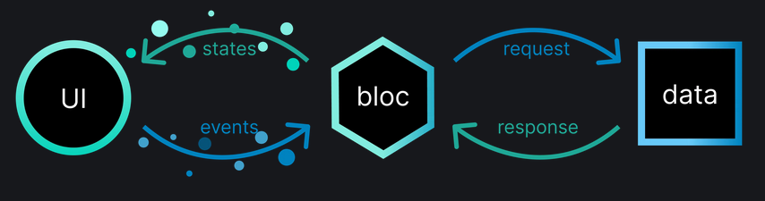

# Basic Concepts

## Flutter

Flutter is an open-source UI software development kit created by Google. It is used to develop applications for Android,
iOS, Linux, Mac, Windows, Google Fuchsia, and the web from a single codebase. Flutter uses the Dart programming language
for app development. It provides a rich set of pre-built widgets that can be customized to create beautiful, responsive
user interfaces. Flutter's hot reload feature allows developers to quickly see changes in the app without losing the app
state, making it easy to experiment and iterate on designs.

### Widget Tree

In Flutter everything is a widget. Widgets are the building blocks of a Flutter app, and they are used to create the
user
interface (UI). Widgets can be simple, like a button or text field, or complex, like a list or grid. Besides you can
create custom widgets by combining existing widgets or creating new ones.

These widgets are organized in a tree structure, with each widget having a parent and children. This tree is called the
widget tree, and it represents the structure of the UI. When you build a Flutter app, you create a widget tree that
defines
the layout and appearance of the app. The Flutter framework then takes this widget tree and renders it on the screen.

### Example

The following picture shows a simplified widget tree of the [`AIDexApp`](../../lib/main.dart). Generally the app uses
the
[`MaterialApp`](https://api.flutter.dev/flutter/material/MaterialApp-class.html) widget as the root widget. This widget
provides the basic layout and navigation for the app. The app consists of multiple screens, each represented by a
different widget. These widgets are organized in a tree structure, with each widget having a parent and children.The
initial widget being loaded is the [`DeckOverview`](../../lib/ui/deck-overview/deck_overview_widget.dart) widget. This
widget
is responsible for displaying all the decks in the app. Each deck is represented by
a [`DeckItemWidget`](../../lib/ui/deck-overview/deck_item_widget.dart), which contains the deck's title.

## BLoC Architecture

BLoC stands for "Business Logic Component" and is a popular architecture pattern in Flutter. It helps you separate
business logic from the user interface, allowing you to maintain a clean structure in your apps. You have two primary
components: the BLoC itself and the UI (user
interface). The BLoC is where you handle all the business logic, while the UI listens for updates from the BLoC.

An important addition to the pattern is the data component, which encompasses the source of truth for your application's
data. This component might include services, repositories, or data storage, and is responsible for fetching, storing,
and updating data from various sources like APIs, local databases, or files. In the BLoC architecture, the BLoC acts as
a bridge between the UI and the data component. It receives events from the UI, retrieves or manipulates data via the
data component, and then streams the resulting states back to the UI.

States and events are objects being exchanged between the BLoC and the UI. The BLoC emits
states causing the UI to rebuild. During the rebuild the UI can access the data of the current state and change the
display accordingly. The BlocBuilder is a widget that performs these rebuilds in the Flutter widget-tree. To change the
state the UI itself can trigger events which are captured by the BLoC. The BLoC is responsible for handling these events
and emitting subsequent states.

### Benfits

| Benefit                  | Description                                                                                                             |
|--------------------------|-------------------------------------------------------------------------------------------------------------------------|
| Separation of Concerns   | BLoC architecture separates business logic from UI, which makes the codebase cleaner and easier to maintain.            |
| Testability              | Since the business logic is separated from the UI, it's easier to write unit tests for the business logic.              |
| Reusability              | BLoC components can be reused across different parts of the app or even across different apps.                          |
| Predictability           | BLoC architecture follows a predictable data flow, which makes it easier to understand how the state changes over time. |
| Consistency              | BLoC enforces a consistent way of managing state and handling business logic across the entire app.                     |
| Scalability              | BLoC architecture is highly scalable. It works equally well for small and large projects.                               |
| Integration with Flutter | BLoC architecture works seamlessly with Flutter's reactive model.                                                       |

## Data Component

The [data component](../../lib/data) is responsible for managing the data in the app. It includes services,
repositories, and
data models
that handle the fetching, storing, and updating of data. The AIDex app uses SQLite as the local database to store decks.
Each deck contains a list of index cards, which are also stored in the database.

The data component is implemented using repositories and providers. Repositories are directly used by the BLoC to fetch,
store, and update data. Providers are used by the repositories to access the local database or other data sources. This
pattern allows for a clean separation of concerns and makes the codebase easier to maintain.
