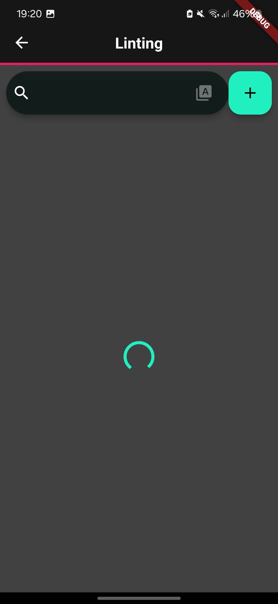
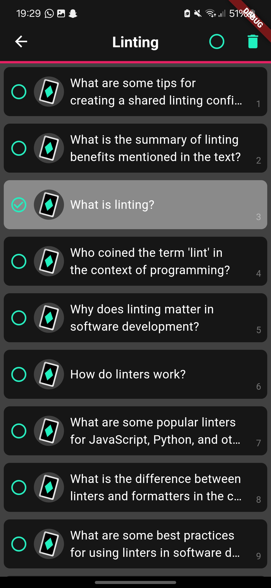
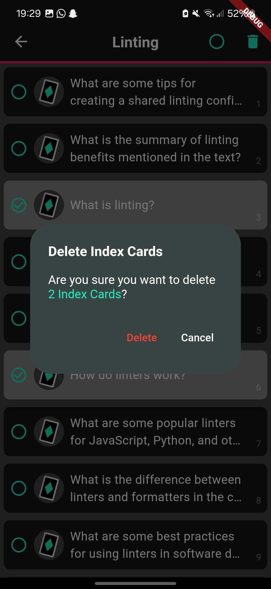

# Code Example

---

## Table of Contents

- [The Index Card Overview](#the-index-card-overview)
- [From an Event to a State](#from-an-event-to-a-state)
- [Rebuilding the UI with BlocBuilder](#rebuilding-the-ui-with-blocbuilder)

## The Index Card Overview

---

In the AIDex app index cards are organized within [`Decks`](../../lib/data/model/deck.dart).
The [`IndexCardOverview`](../../lib/ui/deck-view/index_cards_overview_widget.dart) widget displays a list of
all [`IndexCards`](../../lib/data/model/index_card.dart)
within a [`Deck`](../../lib/data/model/deck.dart). In this view, users can add and delete index cards. Besides a user
can search for index cards, sort them, and select them for deletion.

The table below shows the different states of
the [`IndexCardOverview`](../../lib/ui/deck-view/index_cards_overview_widget.dart) and how they are displayed in the UI.

<a name="indexCardOverviewStates"></a>
<table>
<tr>
<th><p>IndexCardsLoading</p></th>
<th><p>IndexCardSelectionMode</p></th>
<th><p>IndexCardsLoaded</p></th>
<th><p>IndexCardsError</p></th>
</tr>
<tr>
<td></td>
<td></td>
<td></td>
<td></td>
</tr>
</table>

The BLoC is implemented in the [`IndexCardOverviewBloc`](../../lib/bloc/index_cards_overview_bloc.dart) class. This
class is
responsible for changing the state of the index cards overview based on the events it receives. The UI listens to these
state changes and rebuilds accordingly.

This table shows all the states, events, and their attributes used
in [`IndexCardOverviewBloc`](../../lib/bloc/index_cards_overview_bloc.dart):

<div style="display: flex; justify-content: space-between;">
<table style="width: 45%; float: left;">
<thead>
<tr>
<th>Events</th>
<th>Attributes</th>
<th>Action</th>
</tr>
</thead>
<tbody>
<tr>
<td>FetchIndexCards</td>
<td></td>
<td>Fetch index cards from the database.</td>
</tr>
<tr>
<td>UpdateSelectedIndexCards</td>
<td>List&lt;int&gt; indexCardIds</td>
<td>Update the list of selected index cards.</td>
</tr>
<tr>
<td>ExitIndexCardSelectionMode</td>
<td></td>
<td>Exit the index card selection mode.</td>
</tr>
<tr>
<td>RemoveIndexCardsById</td>
<td>List&lt;int&gt; selectedIndexCardsIds</td>
<td>Remove selected index cards by their IDs.</td>
</tr>
<tr>
<td>AddIndexCard</td>
<td>IndexCard indexCard</td>
<td>Add a new index card.</td>
</tr>
<tr>
<td>SearchIndexCards</td>
<td>String query</td>
<td>Search for index cards based on a query.</td>
</tr>
<tr>
<td>SortIndexCards</td>
<td>bool sortAsc</td>
<td>Sort index cards in ascending or descending order.</td>
</tr>
</tbody>
</table>

<div style="width: 10%; float: left;"></div>

<table style="width: 45%; float: right;">
<thead>
<tr>
<th>States</th>
<th>Attributes</th>
<th>Description</th>
</tr>
</thead>
<tbody>
<tr>
<td>IndexCardInitial</td>
<td></td>
<td>The initial state of the index cards overview (contains no index cards).</td>
</tr>
<tr>
<td>IndexCardsLoading</td>
<td>String query</td>
<td>Represents the loading state when fetching index cards.</td>
</tr>
<tr>
<td>IndexCardsLoaded</td>
<td>List&lt;IndexCard&gt; indexCards, <br/>String query</td>
<td>Represents the state when index cards are successfully loaded.</td>
</tr>
<tr>
<td>IndexCardSelectionMode</td>
<td>List&lt;int&gt; indexCardIds, List&lt;IndexCard&gt; indexCards</td>
<td>Represents the state for selecting index cards.</td>
</tr>
<tr>
<td></td>
<td>function: <br/>bool isThisCardSelected(final int indexCardId)</td>
<td></td>
</tr>
<tr>
<td>IndexCardsError</td>
<td>String message</td>
<td>Represents the state when an error occurs.</td>
</tr>
</tbody>
</table>
</div>

## From an Event to a State

Imagine the following scenario:

> 1. The user long-presses an index card to select it for deletion
> 2. The user taps on an additional index card to select it as well.
> 3. The user taps the delete button and confirms the delete dialog.

### The first user action

> The user long-presses an index card to select it for deletion.

<div style="display: flex; justify-content: center">
    
</div>


The first event the UI triggers is `UpdateSelectedIndexCards`. This event is triggered when the user long-presses an
index card and causes the BLoC to update the list of selected index cards.

This is handled the following way in the [`IndexCardItemWidget`](../../lib/ui/deck-view/index_card_item_widget.dart).
Hereby the `updateSelection(context)` function is called via long-press the first time.

<!-- @formatter:off-->
```dart
void updateSelection(final BuildContext context) {
    //Since the method is called for the first time the BLoC isn't in IndexCardSelectionMode yet
    //-> no selected index cards yet -> create an empty list []
    final List<int> selectedIndexCardIds =
        (_state is IndexCardSelectionMode) ? _state.indexCardIds : [];
    //Add the id of the long-pressed IndexCard to the empty list
    if (!selectedIndexCardIds.contains(indexCard.indexCardId)) {
      selectedIndexCardIds.add(indexCard.indexCardId!);
    } else { // is not triggered in this case
      selectedIndexCardIds.remove(indexCard.indexCardId);
    }
    //Trigger the UpdateSelectedIndexCards event with a list containing the long-pressed index card
    //-> currently only the long-pressed index card is selected [long-pressed-index-card-id]
    context.read<IndexCardOverviewBloc>().add(
          UpdateSelectedIndexCards(indexCardIds: selectedIndexCardIds),
        );
  }
```
<!-- @formatter:on-->

The BLoC then emits the `IndexCardSelectionMode` state,
which contains the list of selected index cards.

<div style="display: flex; justify-content: center">
    
</div>

The event `UpdateSelectedIndexCards` is handled in following way in
the [`IndexCardOverviewBloc`](../../lib/bloc/index_cards_overview_bloc.dart):

<!-- @formatter:off-->

```dart
on<UpdateSelectedIndexCards>((final event, final emit) async {
  emit(IndexCardSelectionMode(
  indexCardIds: event.indexCardIds, indexCards: _indexCards));
});
```

<!-- @formatter:on-->

Above you can see that the BLoC emits the `IndexCardSelectionMode` state when handling the `UpdateSelectedIndexCards`
event. This state contains the list of the ids of selected index cards and the list of all index cards of a specific
deck.

### The second user action

> The user taps on an additional index card to select it as well.

<div style="display: flex; justify-content: center">
    
</div>

In this state the `updateSelection(context)` function is called everytime the user selects/deselects an index card by
tapping
it. Given our example the user taps on an additional index card ("How do Linters work") to select it as well.

<!-- @formatter:off-->
```dart
void updateSelection(final BuildContext context) {
    //Get the current selected index cards from the state (since the BLoC is already in the IndexCardSelectionMode) = [long-pressed-index-card-id]
    final List<int> selectedIndexCardIds =
        (_state is IndexCardSelectionMode) ? _state.indexCardIds : [];
    //Case: tapped index card is not selected yet-> add its id to the list -> [long-pressed-index-card-id, tapped-index-card-id]
    if (!selectedIndexCardIds.contains(indexCard.indexCardId)) {
      selectedIndexCardIds.add(indexCard.indexCardId!);
    } else { //Case: tapped Index card is already selected -> User wants to deselect the index card -> remove its id from the list (not the case in this example)
      selectedIndexCardIds.remove(indexCard.indexCardId);
    }
    //Trigger the UpdateSelectedIndexCards event with the updated list of selected index cards
    //-> [long-pressed-index-card-id, tapped-index-card-id]
    context.read<IndexCardOverviewBloc>().add(
          UpdateSelectedIndexCards(indexCardIds: selectedIndexCardIds),
        );
  }
```
<!-- @formatter:on-->

The second event the UI triggers is `UpdateSelectedIndexCards` too. The BLoC behaves the same way as before and emits
the
`IndexCardSelectionMode` state again. This state contains the updated list of selected index cards.

### The third user action

> The user taps the delete button and confirms the delete dialog.

<div style="display: flex; justify-content: center">
    
</div>

The third event the UI triggers is `RemoveIndexCardsById`. This event is triggered when the user taps the delete button
and causes the BLoC to remove the selected index cards (which he got from the `IndexCardSelectionMode` state) from the
database. The BLoC itself triggers the `FetchIndexCards`
event to reload the index cards from the database and emits the `IndexCardsLoaded` state to update the UI.

<div style="display: flex; justify-content: center">
    
</div>

The event `RemoveIndexCardsById` is handled in following way in the
[`IndexCardOverviewBloc`](../../lib/bloc/index_cards_overview_bloc.dart):

<!-- @formatter:off-->

```dart
on<RemoveIndexCardsById>((final event, final emit) async {
  final bool success = await _indexCardRepository
      .removeIndexCards(event.selectedIndexCardsIds);
  if (success) {
    add(const FetchIndexCards()); // triggers the FetchIndexCards event
  } else {
    emit(IndexCardsError(
        message:
            'Failed to delete index cards ${event.selectedIndexCardsIds}'));
  }
});

...

on<FetchIndexCards>((final event, final emit) async {
_query = '';
emit(IndexCardsLoading(query: _query));
try {
_indexCards.clear();
// Fetch index cards and add elements to _indexCards
(await _indexCardRepository.fetchIndexCards(_deckId))
    .forEach(_indexCards.add);
emit(IndexCardsLoaded(indexCards: _indexCards, query: _query));
} on Exception catch (e) {
emit(IndexCardsError(message: e.toString()));
}
});
```

<!-- @formatter:on-->

## Rebuilding the UI with BlocBuilder

The UI listens to the state changes of the BLoC and rebuilds accordingly. This is done using the `BlocBuilder` widget of
the
`flutter_bloc` package. The `BlocBuilder` widget listens to the state changes of the BLoC and rebuilds the UI based on
the
current state.

The following code snippet shows how the index card container within
the [`IndexCardOverview`](../../lib/ui/deck-view/index_cards_overview_widget.dart)
widget is build depending on the current state emitted by
the [`IndexCardOverviewBloc`](../../lib/bloc/index_cards_overview_bloc.dart):

<!-- @formatter:off-->

```dart
Widget _buildIndexCardsContainer() =>
  BlocBuilder<IndexCardOverviewBloc, IndexCardState>(
      builder: (final context, final state) {
    if (state is IndexCardsLoading) {
      return Center(
        child: CircularProgressIndicator(
            valueColor: AlwaysStoppedAnimation<Color>(
          mainTheme.colorScheme.primary,
        )),
      );
    } else if (state is IndexCardSelectionMode) {
      return IndexCardsContainer(state: state, deck: deck);
    } else if (state is IndexCardsLoaded) {
      return IndexCardsContainer(
        state: state,
        deck: deck,
      );
    } else if (state is IndexCardsError) {
      return ErrorDisplayWidget(errorMessage: state.message);
    } else {
      return const ErrorDisplayWidget(
          errorMessage: 'Something went wrong!');
    }
  });
```

<!-- @formatter:on-->

The state determines which widgets are build in the UI. For instance, a loading indicator appears when the state
is `IndexCardsLoading`. When in `IndexCardSelectionMode`, the `IndexCardsContainer` widget shows the selected index
cards. If the state is `IndexCardsLoaded`, the `IndexCardsContainer` widget displays all index cards. Lastly, an error
message is shown when the state is `IndexCardsError`.
